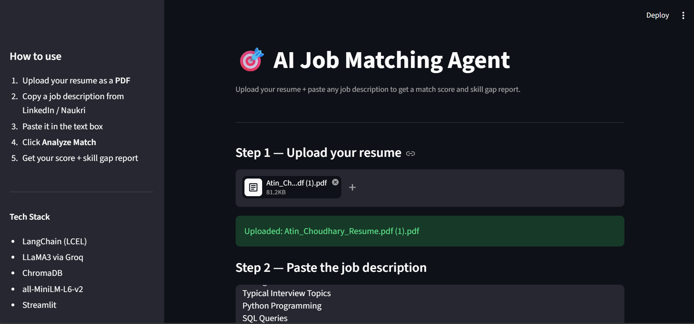

# 🎯 AI Job Matching Agent

An intelligent career assistant that analyzes your resume against any job description and gives you a **match score**, **skill gap report**, and **personalized recommendations** — powered by LLaMA3 and LangChain.

[](https://huggingface.co/spaces/atin-ds-choudhary/ai-job-matching-agent)
[](https://python.org)
[](https://langchain.com)
[](https://streamlit.io)

---
## 🔗 Live Demo
👉 **[Try it here](https://huggingface.co/spaces/atin-ds-choudhary/ai-job-matching-agent)**
## 🖥️ App Preview



## 🚀 What It Does

Upload your resume PDF + paste any job description → the agent:

1. Reads and indexes your resume using vector embeddings
2. Retrieves the most relevant resume sections for the job
3. Passes them to LLaMA3 with a structured prompt
4. Returns a detailed analysis report

**Sample Output:**
```
## Match Score
78/100 — Strong Python and ML skills match, missing cloud deployment experience.

## Matching Skills
- Python, Pandas, NumPy
- XGBoost, Scikit-learn
- LangChain, RAG pipelines
- Streamlit deployment

## Missing Skills
- AWS / GCP cloud experience
- MLflow or model monitoring
- Docker / containerization

## Recommendations
1. Build a small project using AWS S3 or Google Cloud
2. Add MLflow experiment tracking to your churn project
3. Learn basic Docker — one weekend is enough for the basics

## Verdict
Apply now — your core ML + GenAI skills are a strong match.
```

---

## 🛠️ Tech Stack

| Component | Technology |
|-----------|-----------|
| LLM | LLaMA 3.1 8B via Groq |
| Framework | LangChain (LCEL) |
| Embeddings | all-MiniLM-L6-v2 (HuggingFace) |
| Vector Store | ChromaDB |
| UI | Streamlit |
| Deployment | Hugging Face Spaces |

---

## ⚙️ How It Works

```
User uploads Resume PDF
        ↓
PyPDFLoader reads the PDF
        ↓
RecursiveCharacterTextSplitter chunks it (500 chars, 50 overlap)
        ↓
all-MiniLM-L6-v2 creates embeddings (384-dim)
        ↓
ChromaDB stores vectors (MD5 hash — no re-indexing on same file)
        ↓
User pastes Job Description
        ↓
Retriever fetches top 5 relevant resume chunks
        ↓
LLaMA3 via Groq generates structured analysis
        ↓
Streamlit displays Match Score + Report
```

---

## 🏃 Run Locally

**1. Clone the repo**
```bash
git clone https://github.com/AtinChoudhary06/ai-job-matching-agent.git
cd ai-job-matching-agent
```

**2. Install dependencies**
```bash
pip install -r requirements.txt
```

**3. Add your Groq API key**
```bash
# Create a .env file
echo "GROQ_API_KEY=your_key_here" > .env
```
Get a free key at [console.groq.com](https://console.groq.com)

**4. Run the app**
```bash
streamlit run app.py
```

Open `http://localhost:8501` in your browser.

---

## 📁 Project Structure

```
ai-job-matching-agent/
├── agent.py          # AI logic — resume loader, embeddings, LLM chain
├── app.py            # Streamlit UI
├── requirements.txt  # Dependencies
├── .env              # API key (never commit this)
└── .gitignore        # Excludes .env and chroma_db/
```

---

## ✨ Key Features

- **Smart Resume Parsing** — Chunks and indexes any PDF resume automatically
- **No Re-indexing** — MD5 hashing ensures the same resume is never re-processed
- **Structured Output** — Always returns Score, Matching Skills, Gaps, and Recommendations
- **Download Report** — Save your analysis as a `.txt` file
- **Fast** — Groq's LPU inference makes responses near-instant

---

## 🔧 Requirements

```
langchain
langchain-core
langchain-community
langchain-groq
langchain-text-splitters
chromadb
sentence-transformers
streamlit
python-dotenv
pypdf
```

---

## 👨‍💻 About

Built by **Atin Choudhary** — Aspiring Data Scientist & Generative AI Engineer

[](https://github.com/AtinChoudhary06)
[](mailto:atin06choudhary@gmail.com)

---

## 📄 License

MIT License — feel free to use and modify.
